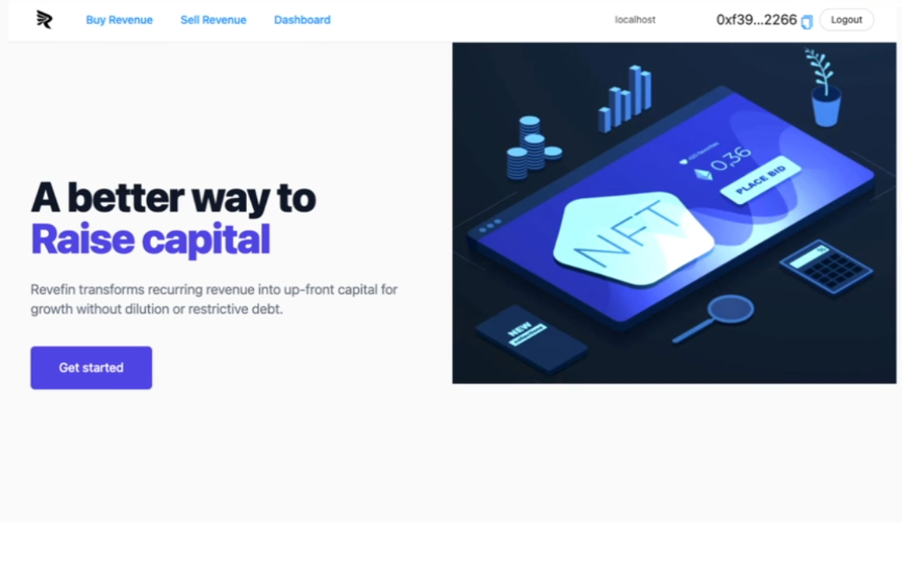

 

### ReveFin

- **ReveFin** is a marketplace for future smart contract revenue. 
- It connects participants who deploy capital ("Buyers") with entities that control a wallet address that receives regular smart contract-generated on-chain payments ("Sellers").

This documentation presents details on the AutoML.NFT dapp and project.

## START HERE
- **[ReveFin dapp](https://moneyhack-dapp.onrender.com/)** is running live on the cloud. The dapp requires MetaMask wallet connection for full functionality.
- **[Documentation](https://github.com/revefin/moneyhack-dapp/blob/main/doc/Documentation.md)** describes the project and the dapp in extensive detail.
- **[Slide Deck [pdf]](https://github.com/revefin/moneyhack-dapp/blob/main/doc/other/ReveFin_v5m.pdf)** compactly presents the project.
- **[YouTube Video**](https://youtu.be/________)** is the demo video for the hackathon.

### ReveFin Main Window

### ReveFin Project Team

Our team consists of professionals from varying backgrounds, united with the ethos of **creating value through innovation**.

 
