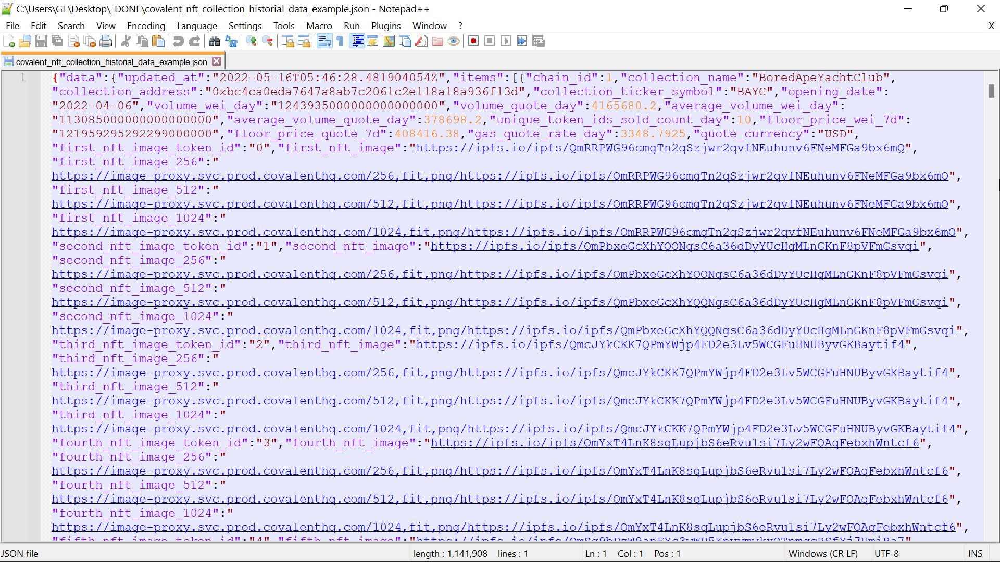
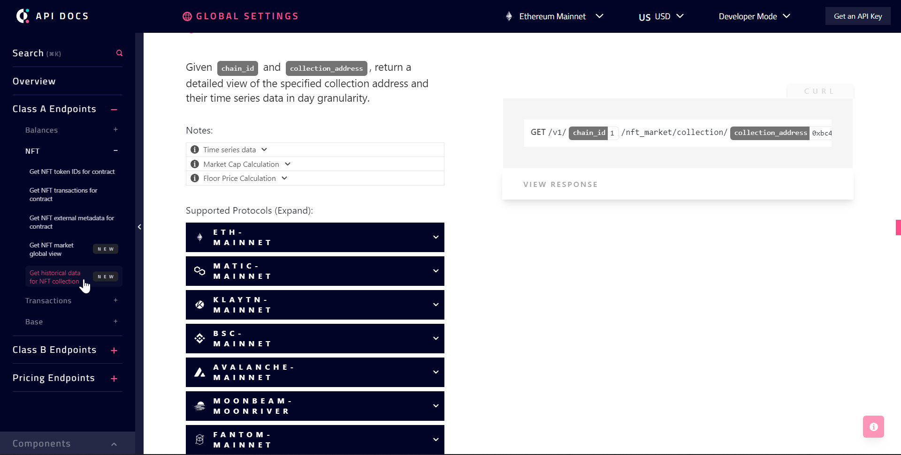
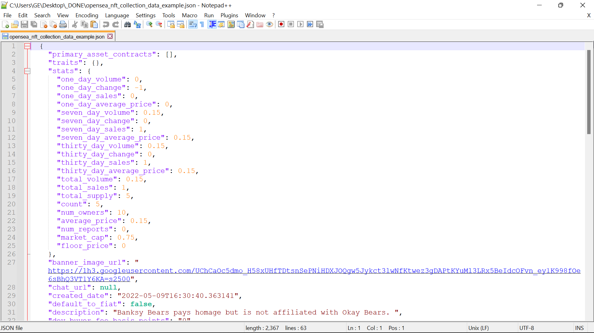
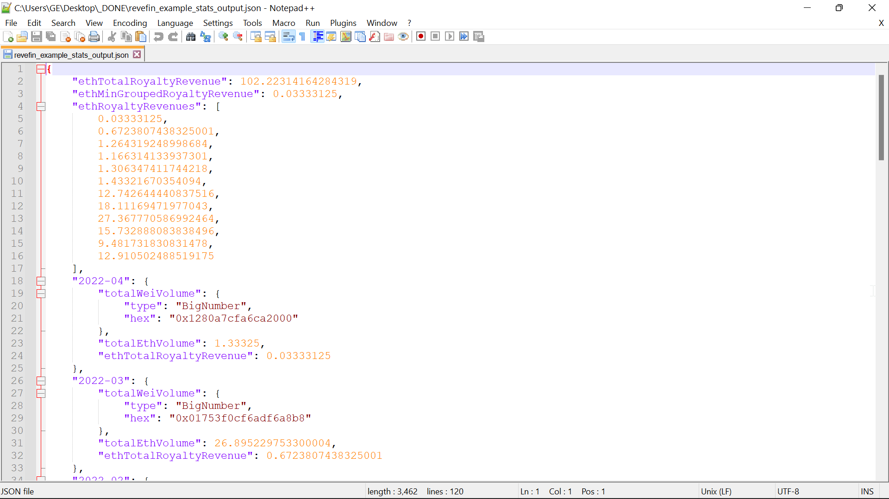

 

## Analytics 

### Data Sources
Data in ReveFin was acquired using the two following libraries:
- [Covalent API](https://www.covalenthq.com/docs/api/#/0/0/USD/1) for historical data on NFT collections, at a daily resolution. (Class A Endpoints >> NFT >> Get historical data for NFT collection)
- [OpenSea API](https://docs.opensea.io/reference/api-overview), specifically the end-point for [retrieving collection statistics](https://docs.opensea.io/reference/retrieving-collection-stats) at a daily resolution.

In addition, some of the data were generated by creating two collections on the [OpenSea testnet](https://testnets.opensea.io/) and executing transactions with the NFTs in these two collections. These two collections are:
- [Simple & Healthy](https://testnets.opensea.io/collection/simpleandhealthy): A custom-curated collection of simple, healty  fusion food, created by a yet-to-be-discovered international gourmet.
- [Crypto Proverbs](https://testnets.opensea.io/collection/cryptoproverb): A custom-curated collection of twisty crypto proverbs, building on popular proverbs. Wisdom for generations to come.

Finally, some of the data in ReveFin were generated as mockup, to better illustrate the features and functionality of the platform.

### Sample Historical Data (Covalent API)

 

This data can be obtained using the following end-point:

 

### Sample Daily Data (OpenSea API)

 

### Sample Statistics in ReveFin

 

    
**Index**

1. [Background](Background.md)
2. [Unique Value Offerings](UniqueValueOfferings.md)
3. [Design Principles](DesignPrinciples.md)
4. [System Architecture](SystemArchitecture.md)
5. [Backend](Backend.md)
6. [Frontend](Frontend.md)
7. **Analytics**
8. [Financial Model](FinancialModel.md)
9. [Technology/Tool Stack](TechnologyStack.md)
10. [Related Projects](RelatedProjects.md)
11. [Other Resources](OtherResources.md)
12. [Future Plans](FuturePlans.md)

<hline></hline>

[Back to Main GitHub Page](../README.md) | [Back to Documentation Index Page](Documentation.md)
