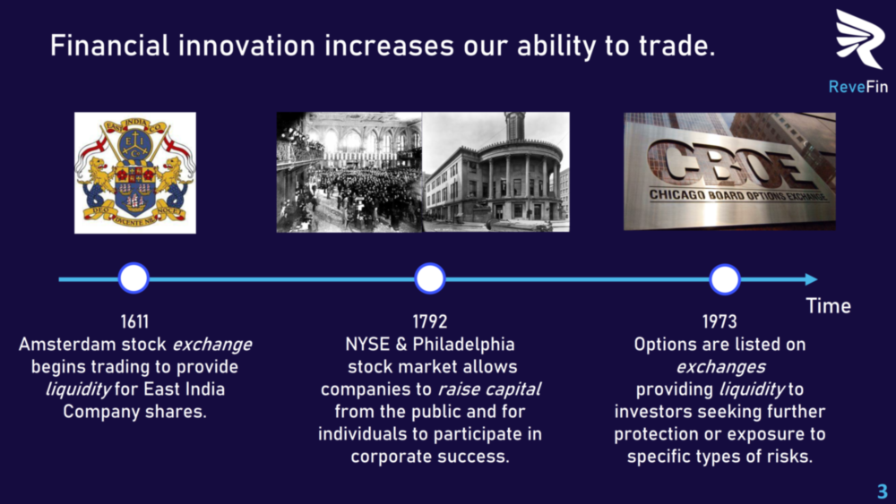

 

## Background

### Trade and Spot Trading

Trade could be the single most important social dealing in human history because of its profound economic benefits. A cod fisherman in Ireland at the turn of the 19th century was likely trading all the time: cod fish for money, money for vegetables, money for potatoes, money for clothes, money for candles, cod fish for candles, cod fish for clothes, cod fish for potatoes, and so on and so forth. A cod fisherman at the time probably engaged in multiple transactions per day, often repeating the same series of transactions every day. This kind of trade is commonly referred to as spot trading: the good/asset/service is exchanged at that specific point in time and the transaction begins and ends when the assets are exchanged.

### Limits to Spot Trading

However, spot trading has its limitations. In 19th century Ireland, during the potato blithe, a potato farmer would not have been able to participate in spot trading for lack of an asset to trade. When spot trading is insufficient, participants need the ability to trade future production. Trading future production introduces new difficulties, such as how to calculate the amount to be repaid. The amount to be repaid can be determined in two ways: X percent of future production (variable) or X units (fixed). Because the potato farmer’s output is uncertain – there could be externalities that affect the farmer’s ability to produce, or the potato farmer could purposefully produce as little as possible – expressing future payment as a percentage of output makes the future payment uncertain. As a result, the amount to be repaid it typically a fixed amount. By making the repayment amount a fixed nominal sum, the onus is entirely on the potato farmer to make the future payment. 

### Legal Contracts

The variability of production output makes a direct claim on output impossible as a form of repayment. Without a direct claim on output, repayment relies on (i) the ability of the farmer to generate the repayment amount and (ii) the farmer’s decision to repay. Because the farmer is the link between output and payment, to incentivize the farmer, non-payment needs to be punishable, and future payment needs to be enforced. Enter: legal agreements. When repayment is not a direct claim on output, legally binding contracts are used to make non-payment punishable by law. Today (and throughout history), trading future capital and future goods relies on legally binding contracts.

### Enforcing Payments in Blockchain

Blockchain technology is permissionless and anonymous. It therefore creates an entirely new set of circumstances that are incompatible with existing methods of trading future goods. Permissionless-ness makes it impossible to use legally binding agreements to make payments enforceable. DeFi lending protocols like Aave and Compound offer a solution to this predicament by requiring collateral. In practice, the solution is often over-collateralization considering the volatility of the underlying assets. An alternative to over-collateralization is to use off-chain agreements, which is the solution adopted by protocols Maple and Centrifuge.

### Importance of Financial Innovation

Financial innovation increases our ability to trade.

The following illustration gives examples of how financial innovations and institutions that implement those innovations have resulted in profound changes in trade, finance, and economics:

 

### Pivotal Idea: Tradeable Future Smart Contract Revenues

The pirvotal idea of the ReveFin project can be summarized as follows: 

"Future (smart contract) revenue that is programmatically certain is a *financial asset,* and it *should be tradeable*."

### Project Objective

The initial motivation and objective of the ReveFin project were to **develop a decentralized system of trading future (smart contract) revenue streams**, with smart contracts enforcing future royalty payments to the investors.

 

Our team consists of professionals from varying backgrounds, united with the ethos of **creating value through innovation**.

 

**Index**

1. **Background**
2. [Unique Value Offerings](UniqueValueOfferings.md)
3. [Design Principles](DesignPrinciples.md)
4. [System Architecture](SystemArchitecture.md)
5. [Backend](Backend.md)
6. [Frontend](Frontend.md)
7. [Analytics](Analytics.md)
8. [Financial Model](FinancialModel.md)
9. [Technology/Tool Stack](TechnologyStack.md)
10. [Related Projects](RelatedProjects.md)
11. [Other Resources](OtherResources.md)
12. [Future Plans](FuturePlans.md)

<hline></hline>

[Back to Main GitHub Page](../README.md) | [Back to Documentation Index Page](Documentation.md)
