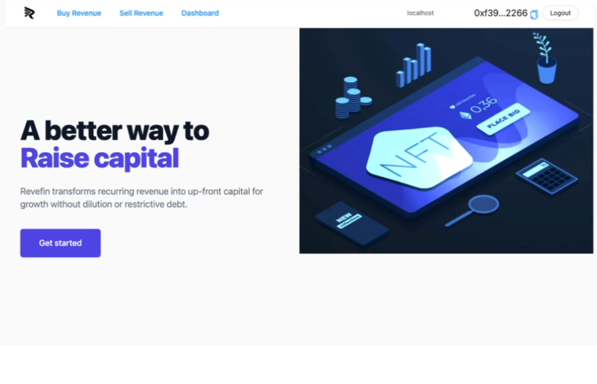
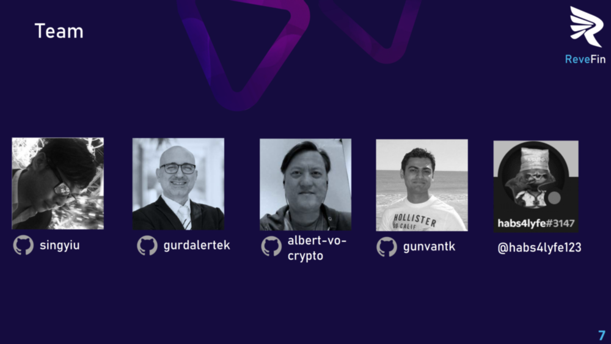

 

- **ReveFin** is a marketplace for future smart contract revenue. 
- It connects participants who deploy capital ("Buyers") with entities that control a wallet address that receives regular smart contract-generated on-chain payments ("Sellers").

This documentation presents details on the ReveFin dapp and project.

## START HERE
- **[ReveFin dapp](https://moneyhack-dapp.onrender.com/)** is running live on the cloud. The dapp requires MetaMask wallet connection for full functionality.
- **[Documentation](https://github.com/revefin/moneyhack-dapp/blob/main/doc/Documentation.md)** describes the project and the dapp in extensive detail.
- **[Slide Deck [pdf]](https://github.com/revefin/moneyhack-dapp/blob/main/doc/other/ReveFin_v5m.pdf)** compactly presents the project.
- **[YouTube Video](https://youtu.be/IDj3o_wPzvw)** is the demo video for the hackathon.

## Index

1. [Background](Background.md)
2. [Unique Value Offerings](UniqueValueOfferings.md)
3. [Design Principles](DesignPrinciples.md)
4. [System Architecture](SystemArchitecture.md)
5. [Backend](Backend.md)
6. [Frontend](Frontend.md)
7. [Analytics](Analytics.md)
8. [Financial Model](FinancialModel.md)
9. [Technology/Tool Stack](TechnologyStack.md)
10. [Related Projects](RelatedProjects.md)
11. [Other Resources](OtherResources.md)
12. [Future Plans](FuturePlans.md)

<hline></hline>

[Back to Main GitHub Page](../README.md) | [Back to Documentation Index Page](Documentation.md)

### ReveFin Main Window

### ReveFin Project Team

Our team consists of professionals from varying backgrounds, united with the ethos of **creating value through innovation**.

 
