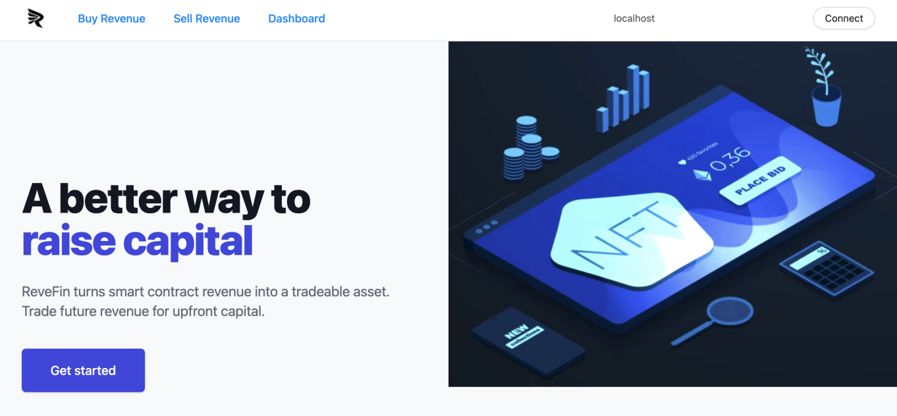
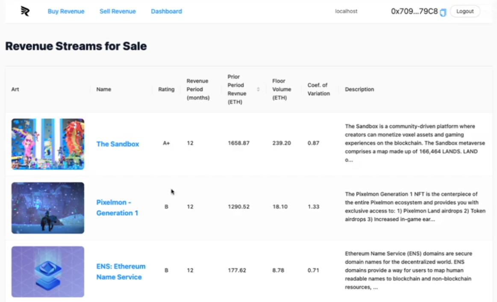
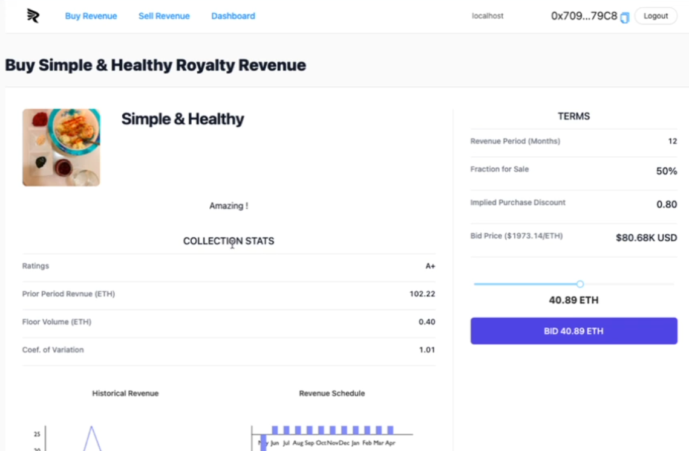
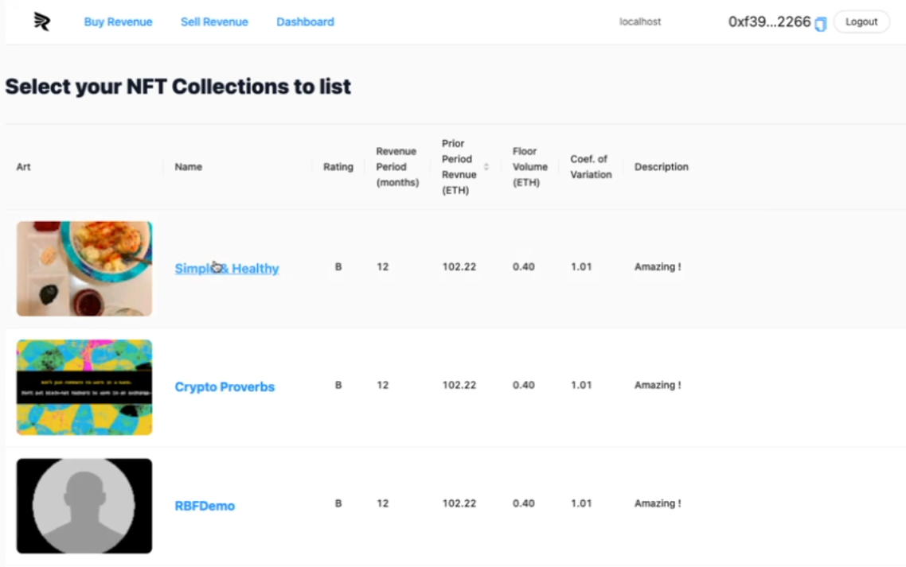
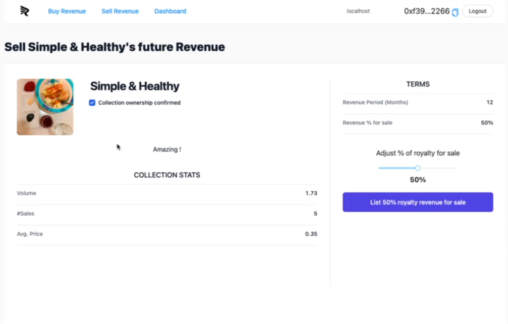
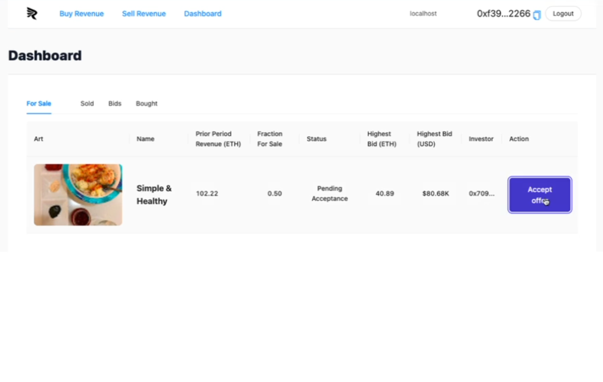
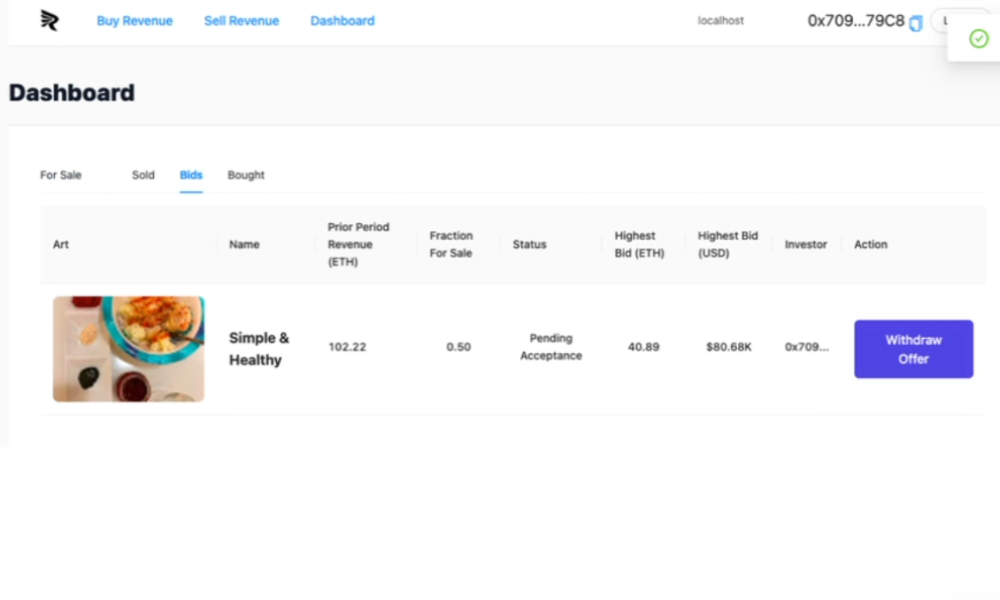
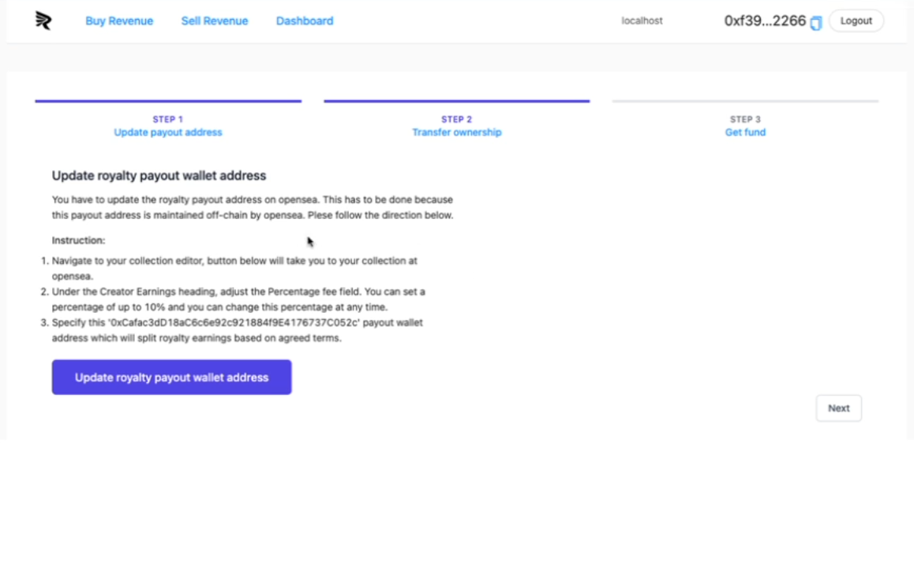

 

## Frontend

This section describes each screen of AutoML.NFT.

### Home Page
This is the home/landing page that welcomes the user. `Get Starter`button directs the user to `Buy Revenue`page. There are three menus that lead to their respective pages, respectively, `Buy Revenue`, `Sell Revenue`, and `Dashboard`.

### Buy Revenue
When the `Buy Revenue` menu item is selected, the page displayed shows `Revenue Streams for Sale`. This is a list of revenue streams on sale. Each revenue stream, in the MVP, is an NFT collection. Each cell in the table displays information about that collection, including computed metrics/statistics. When the image for any of the rows is clicked, details of that revenue stream are displayed for bidding and buying.

### Buy Revenue - Details and Bid 
When the image for any of the rows is clicked, details of that revenue stream are displayed for bidding and buying. The Investor/Lender/Buyer can, using the slider, bid a certain `Purchase price (ETH)` and its `Implied Purchase Discount`, which is the proportion of the revenue stream paid upfront. Clicking the `BID ... ETH` button calls the MetaMask wallet for transaction confirmation.

### Sell Revenue
When the `Sell Revenue` menu item is selected, the page displays a list to `Select your NFT Collections to list`. This is a list of revenue streams that the NFT Creator/Seller/Borrower can put on sale. Each revenue stream, in the MVP, is an NFT collection. Each cell in the table displays information about that collection, including computed metrics/statistics. When the image for any of the rows is clicked, details of that revenue stream are displayed for bidding and buying.

### Sell Revenue - Details and Listing
When one of the revenue streams is collected, the page displayed shows interface to `Sell XYZ's future revenue`, where XYZ is the name of the selected collection. This is the screen where the NFT Creator/Seller/Borrower adjusts the percentage of royatly for sale. This would of course be a number between 0 and 100 (percent). When the `List ..% royalty revenue for sale` button is clicked, the NFT collection is put on listing for sale.

### Dashboard
When the `Dashboard` menu item is clicked, the user sees the `Dashboard`, which shows the NFT collections `For Sale` and `Sold`, as well as the `Bids` and `Bought` revenue streams, with their respective data.

The following screenshot shows the NFT collections `For Sale`:

The following screenshot shows the `Bids` for the NFT collections that are listed for sale:

### Sale Transaction
Once a revenue stream on sale receives a bid, and once the NFT Creator/Seller/Borrower decides to accept the bid, the actual sale transaction, as shown in the figure below, takes place in three steps:
1. **NFT Creator** updates the payout adress.
2. **NFT Creator** transfers ownership of the collection (whose future revenue is being sold) to the ReveFin Vault.
3. **NFT Creator** gets the fund from the ReveFin vault.

**Index**

1. [Background](Background.md)
2. [Unique Value Offerings](UniqueValueOfferings.md)
3. [Design Principles](DesignPrinciples.md)
4. [System Architecture](SystemArchitecture.md)
5. [Backend](Backend.md)
6. **Frontend**
7. [Analytics](Analytics.md)
8. [Financial Model](FinancialModel.md)
9. [Technology/Tool Stack](TechnologyStack.md)
10. [Related Projects](RelatedProjects.md)
11. [Other Resources](OtherResources.md)
12. [Future Plans](FuturePlans.md)

<hline></hline>

[Back to Main GitHub Page](../README.md) | [Back to Documentation Index Page](Documentation.md)
