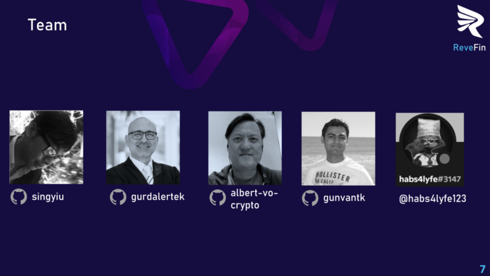

 

## Future Plans for ReveFin

1. Our main **vision** for ReveFin is to grow it into a **"Revenue-based Financing Gateway"** for business, industry, government, NGOs, for financing all types of blockchain revenues from projects, DAOs, and platforms. Rather than being a narrow application, the system we envision is a **Finance Center**, where all types of smart contract / on-chain revenues are encapsulated, parameterized, listed, propogated, and traded. 
2. Platforms can be allowed to use functionality of ReveFin through ReveFin API, opening the door for revenue and **codenomics** (economics of code). 
3. A full-fledged **datanomics** (data economics) model can be created, that will enable **monetization from the ReveFin dapp**. Basic ideas of displaying paid ads and selling generated reports could be only a small part of the whole system. The best parameters for both borrowers (NFT creators in the MVP) and lenders (Investors in the MVP) can be computed/predicted and monetized upon. Building on these basics, much more could be possible. Possibilities include monetizing from analytics reports, intermediate computed data (ex: train/test data generated from transactions), rendered interactive charts and animations, and as mentioned earlier, API access. A subscription-based model can also be adopted, where subscribers pay upfront monthly or annual fees, which can bring them big savings. If a token is to be issued for ReveFin, a full-fledged [tokenomics design](https://maxyampolsky.medium.com/how-to-design-tokenomics-for-your-cryptocurrency-the-basics-of-creating-your-token-9a0375cb9479) is needed, which mitigates against different types of technical, legal, economic, and social risks, and ensures economics value and growth. For example, in both datanomics and tokenomics design, it is important to make sure not to distribute tokens to users randomly, as this may be [labeled as lottery and sued by some users](https://cryptobriefing.com/a-guy-put-10-ethereum-defi-app/).
4. Users can be allowed to **customize ReveFin's analytics dashboards** by selecting snippets and favored [color palettes](https://www.crazyegg.com/blog/website-color-palettes/). These palettes can include pallets that are suitable for [color blindness](https://www.color-blindness.com/), similar to [R packages for color blindness](https://www.datanovia.com/en/blog/top-r-color-palettes-to-know-for-great-data-visualization/). Another possibility is to use [color palettes inspired by photos of nature](https://sarahrenaeclark.com/color-palettes/).
5. Several **other analyses categories and types** can be added to the analytics for revenue stream NFTs on sale. 
6. Existing and new visual analytics methods can be implemented using **data analytics code libraries**, including Python visualization/animation/storytelling libraries (such as [seaborn](https://seaborn.pydata.org/examples/index.html)) whose output may be displayed on the frontend within the dapp.
7. **Advanced data analytics methods** and [machine learning (ML)](https://www.coursera.org/collections/machine-learning) algorithms, including **deep learning, unsupervised learning** and even **prescriptive analytics**, can be implemented within the dapp into the future, using some of the [top data science software libraries](https://towardsdatascience.com/8-booming-data-science-libraries-you-must-watch-out-in-2022-cec2dbb42437).
8. With the permission of the user, meta-data about the analyzed data and analysis results, as well as metrics in the generated reports, can be **published on** [ChainLink](https://chain.link) and other **oracles as feeds**.  
9. Transactions and other **feeds can be published as webhooks** [as described here](https://www.youtube.com/watch?v=41NOoEz3Tzc), **allowing RPA tools** such as [Zapier](https://zapier.com/), [CaptainData](https://app.captaindata.co), [Konnectzit](https://app.konnectzit.com) and [Hexomatic](https://hexomatic.com) **to connect to these hooks** and perform many interesting actions, including **automated notification/signal/alert push messages to social media**.
10. On the documentation side, the developed code, especially the Javascript **code can be visually documented** using [SmartDraw's Automated Class Diagrams Extensions](https://www.smartdraw.com/developers/extensions/class-diagram.htm)
11. With respect to documentation, [automated code documentation tools](https://solidity-domain-for-sphinx.readthedocs.io/en/latest/autodoc.html) can be used to obtain detailed documentation for smart contracts and other code collections.
12. The user interfaces for both the borrower (NFT Creator in the MVB) and lender (Investor in the MVP) can be enhanced to enable financial simulations. To this end, the following research paper can provide useful insights:
- Putilov, A., Baranova, I., & Myakota, E. A. (2018). Financial simulation model of the Income-Share Agreement. *Revista Espacios Education,* 20, 1-12.
13. Many **other opportunities** for improvement have been identified and listed through brain storming sessions and are available as internal notes.

We, as the ReveFin Project Team, **thank you** for your interest in our project, and reading it to the last line :)

 

**Index**

1. [Background](Background.md)
2. [Unique Value Offerings](UniqueValueOfferings.md)
3. [Design Principles](DesignPrinciples.md)
4. [System Architecture](SystemArchitecture.md)
5. [Backend](Backend.md)
6. [Frontend](Frontend.md)
7. [Analytics](Analytics.md)
8. [Financial Model](FinancialModel.md)
9. [Technology/Tool Stack](TechnologyStack.md)
10. [Related Projects](RelatedProjects.md)
11. [Other Resources](OtherResources.md)
12. **Future Plans**

<hline></hline>

[Back to Main GitHub Page](../README.md) | [Back to Documentation Index Page](Documentation.md)
