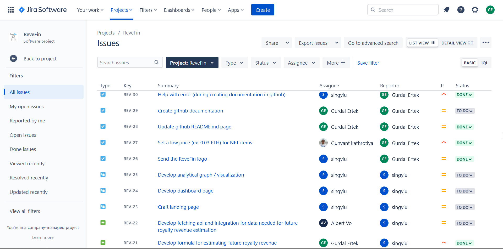

 

## Technology/Tool/Resource Stack

### Hackathon Sponsor Technologies

- Compound for staking
- Covalent for indexing and fetching on-chain metadata
- EPNS for notification
- WalletConnect for wallet
- IPFS for storing NFT images
- *[In development]* CoinWallet
- *[In development]* IPFS for hosting dApp
- APWine

### Frontend
- **[scaffold-eth boilerplate](https://github.com/scaffold-eth/scaffold-eth)** for rapid prototyping
- **[React.js](https://reactjs.org/)** Javascript library for the front end. 

### Backend
- **[scaffold-eth boilerplate](https://github.com/scaffold-eth/scaffold-eth)** for rapid prototyping
- **Solidity** for the backend smart contracts
- **Hardhat**
- **Remix**
- **Compound** for staking
- **EPNS** for notification
- **WalletConnect** for wallet functionality
- **[IPFS](https://ipfs.io/)** for storing NFT images
- **CoinWallet** *[In development]* 
- **[IPFS](https://ipfs.io/)** for hosting dApp *[In development]* 
- NodeJS
- Express
- MongoDB
- AWS

### Data & Analytics
- **[Covalent API](https://www.covalenthq.com/docs/api/#/0/0/USD/1)** and **[OpenSea API](https://docs.opensea.io/reference/api-overview)** for indexing and fetching on-chain metadata
- **Redux** for storage of data in json files

### Content Curation
- **[Deposit Photos](https://depositphotos.com)** and **[Yay Images](https://yayimages.com)**, for stock photo with licenses granted for the team members.
- **[The Noun Project](https://thenounproject.com)** for icons, with licenses granted for the team members. 
- **Original logo** for ReveFin was created **by** ReveFin Team Member **Sing Yiu.**
- **[Aicoosoft Video Converter](https://www.aicoosoft.com/video-converter.html)** for video recording and compression
- **[CyberLink PowerDirector](https://www.cyberlink.com/products/powerdirector-video-editing-software/overview_en_US.html)** for video production
- **[Ant Renamer](https://antp.be/software/renamer)** for automated sequential file renaming
- **[XnConvert](https://www.xnview.com/en/xnconvert/)** for batch editing/conversion of images

### Other
- **[OnRender](https://onrender.com)** for deployment
- **[Atlassian Jira](https://atlassian.com)** for task management (using the Bug tracking template, a snapshot shown below)
- **[Discord](https://discord.com)** for communication
- **[Github](https://github.com)** for versioning

 

**Index**

1. [Background](Background.md)
2. [Unique Value Offerings](UniqueValueOfferings.md)
3. [Design Principles](DesignPrinciples.md)
4. [System Architecture](SystemArchitecture.md)
5. [Backend](Backend.md)
6. [Frontend](Frontend.md)
7. [Analytics](Analytics.md)
8. [Financial Model](FinancialModel.md)
9. **Technology/Tool Stack**
10. [Related Projects](RelatedProjects.md)
11. [Other Resources](OtherResources.md)
12. [Future Plans](FuturePlans.md)

<hline></hline>

[Back to Main GitHub Page](../README.md) | [Back to Documentation Index Page](Documentation.md)
