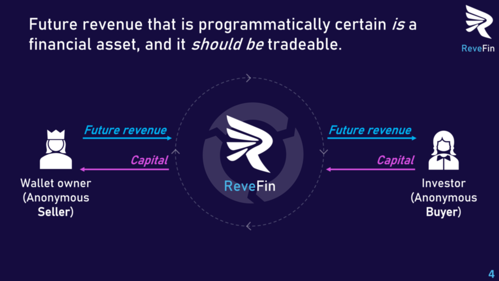
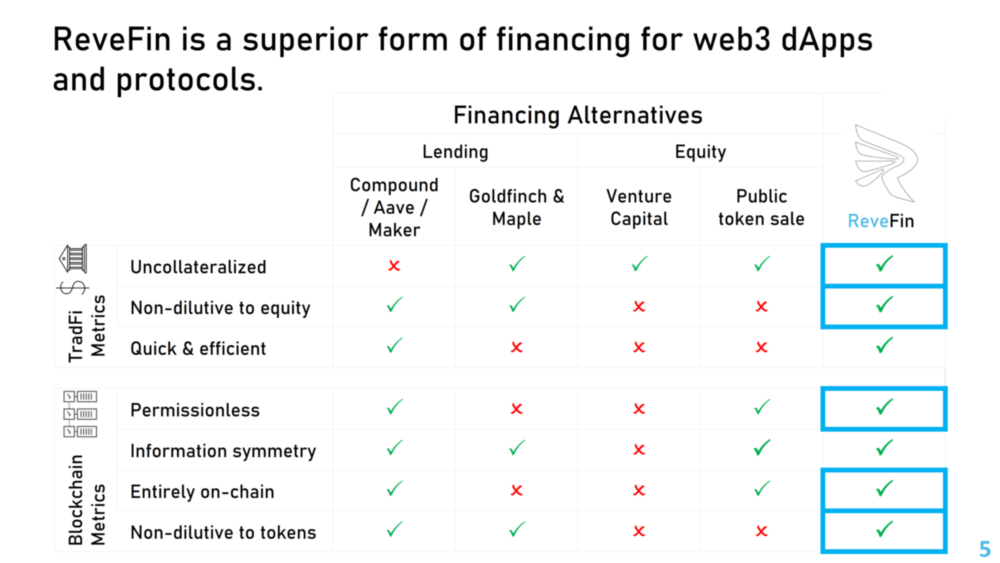
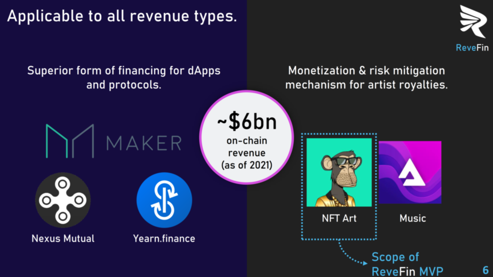

 

## Unique Value Offerings

### ReveFin

- **ReveFin** is a marketplace for future smart contract revenue. 
- It connects participants who deploy capital ("Buyers") with entities that control a wallet address that receives regular smart contract-generated on-chain payments ("Sellers").

The following illustration illustrates how ReveFin enables trading of future smart contract revenues:

 

### Smart Contracts in ReveFin

1. To unlock the full potential of the blockchain ecosystem, there needs to be a way to **trade future assets**, in a permissionless manner and without collateral.
2. Smart contracts that generate revenue payments are 100% certain to behave they way they are programmed. This removes the uncertainty related to the expected output of the contract. It then becomes possible to program an automatic claim on the revenue generated by the smart contract. 
3. A direct claim on the revenue generated by a smart contract removes any repayment decision – the revenue is claimed immediately. Thus, by selling the claim to future revenue generated by smart contracts, the need for enforceability disappears. 
4. Without the need for enforceability, the need for collateral disappears. 
5. The programmatic certainty of smart contract revenue makes future smart contract revenue tradeable. 
6. An anonymous entity can thus **obtain capital in a permissionless way and without collateral** by trading future smart contract revenue.

### Benefits of ReveFin Over Other Financing Alternatives

ReveFin is a superior form of financing for web3 dApps and protocols, as shown in the following comparison table with respect to other financing alternatives:
 
 

### How Big Can ReveFin Get?

1. ReveFin is a **financing alternative for all types of revenue on the blockchain**. ReveFin has no established competitors. The closest analogy is Pipe in TradFi. Its benchmarks are revenue-based financing projects in the blockchain world, as explained in [Related Projects](./RelatedProjects.md) page.
2. ReveFin is part of a new financial sector in blockchain, which is a novel innovative sub-sector within **DeFi 3.0.**
3. The potential for ReveFin is endless. [According to The Insight Partners](https://www.globenewswire.com/news-release/2022/02/11/2383531/0/en/Blockchain-Market-Size-Worth-227-99Bn-Globally-by-2028-at-72-9-CAGR-Exclusive-Report-by-The-Insight-Partners.html), the market size of blockchain enabled businesses is expected to reach $228bn by 2028, which represents a 73% compound annual growth rate (CAGR). Assuming ReveFin captures 10% of that market in terms of annual volume, and assuming a 5% take rate on every transaction, ReveFin could generate over $1bn of revenue in 2028.
4. While ReveFin and the trade of future revenues can be extended/expanded to cover all revenue types on the blockchain, as the following figure illustrates, the **scope of the ReveFin MVP** for the HackMoney hackathon is **only NFT art**, specifically NFT art on OpenSea.

 

**Index**

1. [Background](Background.md)
2. **Unique Value Offerings**
3. [Design Principles](DesignPrinciples.md)
4. [System Architecture](SystemArchitecture.md)
5. [Backend](Backend.md)
6. [Frontend](Frontend.md)
7. [Analytics](Analytics.md)
8. [Financial Model](FinancialModel.md)
9. [Technology/Tool Stack](TechnologyStack.md)
10. [Related Projects](RelatedProjects.md)
11. [Other Resources](OtherResources.md)
12. [Future Plans](FuturePlans.md)

<hline></hline>

[Back to Main GitHub Page](../README.md) | [Back to Documentation Index Page](Documentation.md)
